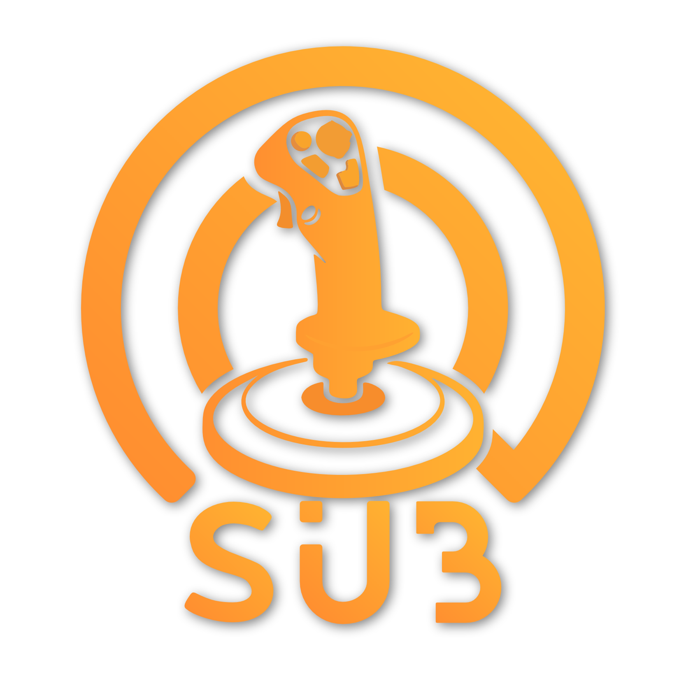

<p align="center">
  <picture>
    <source media="(prefers-color-scheme: dark)" srcset="assets/logo-white.png">
    
  </picture>
</p>

# Bindings Tools

Shared tooling for the [SubliminalsTV Curated Bindings](https://github.com/Subs-Curated-Bindings) org.

## Layout

| Folder | Audience | What |
| --- | --- | --- |
| [`toolkit/`](toolkit/) | **End users** | The unified, stick-aware **Bindings Toolkit** (PowerShell). One tool that detects which stick you're running and handles the common Star Citizen binding-maintenance tasks (MFD fix, axis-invert reset, clear, restore, diagnostics, prune). A built copy ships inside each stick's download. |
| [`dev/`](dev/) | **Maintainer** | Authoring / audit / release scripts — JG profile audits, the distribution-zip builder, the HumanLabel + SC-actions pipeline, and per-stick migration one-offs. |

## Using the `dev/` scripts

Most scripts operate on a single stick and take a path argument (e.g. `--layout`, `--stick-folder`). Cross-stick scripts (the HumanLabel matcher, chart-corpus miner) expect the **stick repos checked out side by side** — clone the sticks you need next to this repo, then point the scripts at their folders.

```
Subs-Curated-Bindings/
├── Bindings-Tools/            (this repo)
├── VKB-Dual-GladiatorNXT/
├── Thrustmaster-Dual-SOLR2/
└── …
```

See [`dev/README.md`](dev/README.md) for the end-to-end profile-polish workflow.

---

Part of **[SubliminalsTV Curated Bindings](https://github.com/Subs-Curated-Bindings)**.
